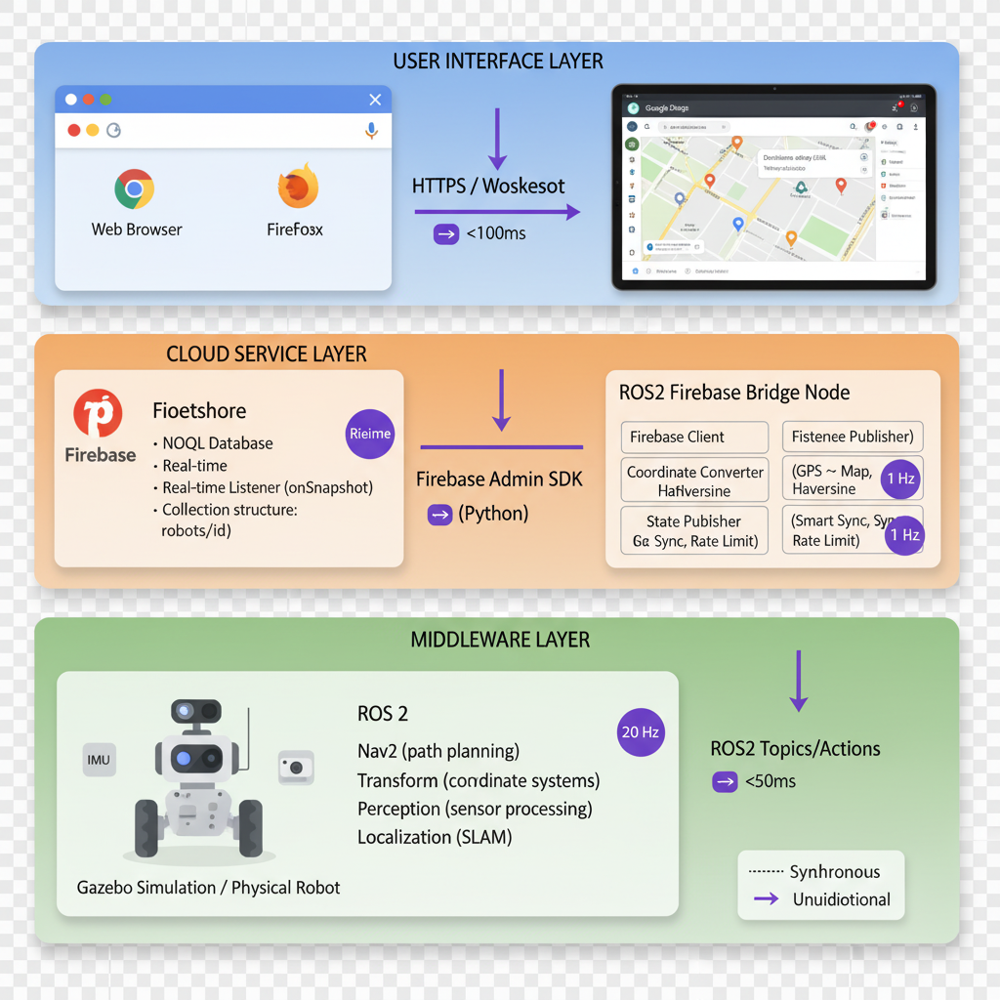

# 🤖 ROS2 Firebase Bridge

ROS2とFirebaseを統合した自律走行ロボット用クラウド連携ブリッジ

Cloud-connected autonomous navigation bridge for TurtleBot3 using Firebase and ROS2




---

## 🇯🇵 日本語

### 📋 概要

FirebaseのリアルタイムデータベースとROS2ナビゲーションスタックを統合するブリッジノード。Webインターフェースからのクラウド経由でロボットを制御可能にします。

- 🔥 **Firebase統合**: Firestoreリアルタイムリスナーによるクラウド指令受信
- 🧭 **Nav2ナビゲーション**: ROS2 Navigation Stackとの完全統合
- 📍 **座標変換**: GPS座標 ↔ ROS2マップ座標の双方向変換
- 📊 **テレメトリ送信**: バッテリー、速度、LiDAR、ナビゲーションデータの配信
- 🛡️ **安全機構**: 境界チェック、無限ループ防止

### 🏗️ アーキテクチャ
┌─────────────────────────────────────────────────┐
│         ROS2 Firebase Bridge Node              │
│                                                 │
│  ┌──────────────────────────────────────────┐  │
│  │        Firebase Client                   │  │
│  │  - Firestoreリアルタイムリスナー         │  │
│  │  - ロボット状態更新                      │  │
│  │  - テレメトリ送信                        │  │
│  └──────────────────────────────────────────┘  │
│                                                 │
│  ┌──────────────────────────────────────────┐  │
│  │    Coordinate Converter                  │  │
│  │  - GPS → Map座標変換                     │  │
│  │  - Haversine距離計算                     │  │
│  │  - 境界検証                              │  │
│  └──────────────────────────────────────────┘  │
│                                                 │
│  ┌──────────────────────────────────────────┐  │
│  │    State Publisher (スマート同期)       │  │
│  │  - レート制限 (1 Hz)                    │  │
│  │  - デルタベースフィルタリング           │  │
│  │  - 位置重複排除                          │  │
│  └──────────────────────────────────────────┘  │
│                                                 │
│  ┌──────────────────────────────────────────┐  │
│  │    Sensor Aggregator                     │  │
│  │  - LiDAR処理                             │  │
│  │  - IMU統合                               │  │
│  │  - バッテリー監視                        │  │
│  │  - テレメトリパッケージング             │  │
│  └──────────────────────────────────────────┘  │
└─────────────────────────────────────────────────┘
↕️
┌─────────────────────────┐
│   ROS2 Nav2 Stack       │
│  - /navigate_to_pose    │
│  - /odom                │
│  - /scan                │
└─────────────────────────┘

### 🚀 クイックスタート

#### 前提条件

- **OS**: Ubuntu 22.04 (Jammy)
- **ROS2**: Humble Hawksbill
- **Python**: 3.10+
- **Docker**: 最新版（Dev Container用）
- **Firebase**: Firestoreが有効化されたプロジェクト

#### セットアップ手順

**方法1: Dev Container（推奨）**

1. **リポジトリのクローン**
```bash
git clone https://github.com/Iruazu/mobility-ros2-firebase.git
cd mobility-ros2-firebase

VS Codeで開く

bashcode .

コンテナで再起動


F1 → "Dev Containers: Reopen in Container"
ビルド完了まで待機（初回は約5分）


Firebase設定

bash# コンテナ内で実行
cp /path/to/serviceAccountKey.json config/

ビルドと起動

bashcolcon build --symlink-install
source install/setup.bash

# ターミナル1: Gazeboシミュレーション
ros2 launch turtlebot3_gazebo turtlebot3_world.launch.py

# ターミナル2: ナビゲーションスタック
ros2 launch turtlebot3_navigation2 navigation2.launch.py

# ターミナル3: Firebaseブリッジ
ros2 run ros2_firebase_bridge firebase_bridge
方法2: ローカルインストール

ROS2 Humbleインストール

bash# 公式ガイドに従う:
# https://docs.ros.org/en/humble/Installation/Ubuntu-Install-Debians.html

依存関係インストール

bashsudo apt update
sudo apt install -y \
  ros-humble-nav2-bringup \
  ros-humble-turtlebot3* \
  python3-pip

pip3 install firebase-admin google-cloud-firestore

クローンとビルド

bashcd ~/ros2_ws/src
git clone https://github.com/Iruazu/mobility-ros2-firebase.git

cd ~/ros2_ws
colcon build --symlink-install
source install/setup.bash
📁 プロジェクト構造
mobility-ros2-firebase/
├── src/ros2_firebase_bridge/
│   ├── ros2_firebase_bridge/
│   │   ├── __init__.py
│   │   ├── firebase_bridge_node.py      # メインROS2ノード
│   │   ├── firebase_client.py           # Firestoreクライアント
│   │   ├── coordinate_converter.py      # GPS ↔ Map変換
│   │   ├── state_publisher.py           # スマート位置同期
│   │   └── sensor_aggregator.py         # テレメトリ収集
│   │
│   ├── config/
│   │   ├── firebase_config.yaml         # 設定ファイル
│   │   └── serviceAccountKey.json       # Firebase認証情報（.gitignore）
│   │
│   ├── package.xml                      # ROS2パッケージマニフェスト
│   └── setup.py                         # Pythonパッケージ設定
│
├── .devcontainer/
│   ├── Dockerfile                       # Dev Containerイメージ
│   └── devcontainer.json                # VS Code設定
│
├── scripts/
│   ├── build_and_run.sh                 # クイック起動スクリプト
│   └── test_firebase.py                 # Firebase接続テスト
│
└── docs/
    ├── SETUP.md                         # 詳細セットアップガイド
    ├── COORDINATE_SYSTEM.md             # 座標変換ドキュメント
    └── TROUBLESHOOTING.md               # トラブルシューティング
🔧 設定
Firebase設定ファイル (config/firebase_config.yaml)
yamlfirebase:
  service_account_key: "/workspace/config/serviceAccountKey.json"
  database_url: "https://your-project.firebaseio.com"

ros2:
  robot_namespace: "/turtlebot3"
  goal_topic: "/goal_pose"
  odom_topic: "/odom"

coordinate_system:
  origin_latitude: 36.55077      # マップ原点（GPS）
  origin_longitude: 139.92957
  map_frame: "map"
  base_frame: "base_link"
  scale_factor: 0.01             # GPS距離 → Map距離
                                  # 0.01 = GPS 100m → Map 1m（シミュレーション）
                                  # 1.0  = GPS 1m → Map 1m（実機）

  map_bounds:                    # TurtleBot3 World制限
    x_min: -4.0
    x_max: 4.0
    y_min: -4.0
    y_max: 4.0

navigation:
  goal_tolerance: 0.3            # メートル
  navigation_timeout: 300        # 秒
  max_retries: 3

telemetry:
  update_interval: 2.0           # 秒
  position_update_interval: 2.0
  sensor_update_interval: 1.0
🎯 コアコンポーネント
1️⃣ Firebase Bridge Node (firebase_bridge_node.py)
メインオーケストレーター
主要メソッド:
pythondef on_firestore_update(robot_id, robot_data, change_type):
    # Firebaseから新しい目的地を検出
    # Nav2にナビゲーションゴールを送信

def send_navigation_goal(destination):
    # GPS → Map座標に変換
    # /navigate_to_pose アクションサーバーに送信
2️⃣ Coordinate Converter (coordinate_converter.py)
GPS ↔ ROS2マップ座標変換
主要メソッド:
pythondef gps_to_map_coordinates(lat, lng) -> Dict[str, float]:
    # {'x': float, 'y': float} をメートル単位で返す

def map_to_gps_coordinates(x, y) -> Dict[str, float]:
    # {'lat': float, 'lng': float} を返す

def validate_goal(lat, lng) -> Tuple[bool, str]:
    # ゴールがマップ境界内かチェック
座標変換式:
python# GPS → Map
R = 6371000  # 地球半径（メートル）
dlat = radians(lat - origin_lat)
dlng = radians(lng - origin_lng)

x_raw = dlng * R * cos(radians(origin_lat))
y_raw = dlat * R

x_map = x_raw * scale_factor  # スケーリング適用
y_map = y_raw * scale_factor
3️⃣ State Publisher (state_publisher.py)
スマート位置同期
主要メソッド:
pythondef should_publish_update(robot_id, new_position, new_heading) -> bool:
    # 重要な変化がある場合のみTrueを返す

def publish_state(robot_id, map_x, map_y, heading):
    # 変換してFirebaseに送信
4️⃣ Sensor Aggregator (sensor_aggregator.py)
テレメトリ収集・送信
テレメトリデータ構造:
python{
  'battery_percent': 85.5,
  'battery_voltage': 12.3,
  'battery_charging': False,
  'speed': 0.22,
  'obstacle_detected': True,
  'min_obstacle_distance': 0.35,
  'distance_to_goal': 2.5
}
🔄 データフロー
コマンドフロー（Web → ロボット）
1. ユーザーが地図をクリック（Web UI）
   ↓
2. Firebase: robots/robot_001/destination = GeoPoint(lat, lng)
   ↓
3. Firestoreリスナーが変更を検知
   ↓
4. on_firestore_update() がトリガー
   ↓
5. ハッシュベース重複排除チェック
   ↓
6. CoordinateConverter: GPS → Map (x, y)
   ↓
7. 境界検証
   ↓
8. PoseStampedをマップ座標で作成
   ↓
9. Nav2 NavigateToPoseアクション呼び出し
   ↓
10. ロボットが自律走行
位置同期（ロボット → Web）
1. /odom トピックがposeを送信
   ↓
2. odom_callback() がメッセージ処理
   ↓
3. StatePublisherがフィルタリング:
   - 前回更新から1秒以上経過？
   - 位置が10cm以上変化？
   - 向きが5°以上変化？
   ↓
4. YES の場合: CoordinateConverter Map → GPS
   ↓
5. Firebase: robots/robot_001/position = GeoPoint(lat, lng)
   ↓
6. Web UIマーカーがリアルタイム更新
🛡️ 安全機構
1. 無限ループ防止
python# ハッシュベース目的地重複排除
destination_hash = hashlib.md5(f"{lat:.8f}_{lng:.8f}".encode()).hexdigest()

if new_hash == self.destination_hash:
    return  # 処理をスキップ
2. 境界チェック
python# 範囲外ゴールの自動補正
if not is_within_bounds(x, y):
    x_safe, y_safe = clamp_to_bounds(x, y)
    logger.warning(f"ゴール補正: ({x}, {y}) → ({x_safe}, {y_safe})")
3. ナビゲーションタイムアウト
python# 5分後に停止したナビゲーションを自動キャンセル
if navigation_duration > 300:
    cancel_navigation()
    set_status('idle')
📊 ROS2トピック
購読トピック
トピック型説明/odomnav_msgs/Odometryロボット位置と速度/scansensor_msgs/LaserScanLiDAR障害物データ/battery_statesensor_msgs/BatteryStateバッテリー状態
配信トピック
トピック型説明/goal_posegeometry_msgs/PoseStampedナビゲーションゴール可視化
アクションクライアント
アクション型説明/navigate_to_posenav2_msgs/NavigateToPoseNav2ナビゲーション指令
🧪 テスト
1. Firebase接続テスト
bashpython3 scripts/test_firebase.py
期待される出力:
🔥 Firebase接続テストを開始します...
✅ Firebase認証ファイル確認: /workspace/config/serviceAccountKey.json
✅ Firebase Admin SDK 初期化成功
✅ Firestore接続成功
✅ Firestoreにテストデータを書き込み成功
✅ robotsコレクション確認: 1個のロボットが登録されています
🎉 Firebase接続テスト完了！
2. 座標変換テスト
pythonfrom ros2_firebase_bridge.coordinate_converter import CoordinateConverter

converter = CoordinateConverter(
    origin_lat=36.55077,
    origin_lng=139.92957,
    scale_factor=0.01
)

# GPS → Map
map_coords = converter.gps_to_map_coordinates(36.55177, 139.93057)
print(f"Map: {map_coords}")  # 期待値: {'x': ~1.0, 'y': ~1.1}

# Map → GPS
gps_coords = converter.map_to_gps_coordinates(1.0, 1.1)
print(f"GPS: {gps_coords}")  # 元の座標と一致するはず
3. フルシステムテスト
bash# ターミナル1: シミュレーション起動
ros2 launch turtlebot3_gazebo turtlebot3_world.launch.py

# ターミナル2: ナビゲーション開始
ros2 launch turtlebot3_navigation2 navigation2.launch.py

# ターミナル3: ブリッジ実行
ros2 run ros2_firebase_bridge firebase_bridge

# ターミナル4: トピック監視
ros2 topic echo /goal_pose
ros2 topic hz /odom
🐛 トラブルシューティング
問題: Firebase接続失敗
症状: ❌ Firebase初期化失敗 エラー
解決策:

serviceAccountKey.json が config/ に存在するか確認
ファイルパーミッション確認: chmod 644 config/serviceAccountKey.json
JSON形式検証: python3 -m json.tool config/serviceAccountKey.json

問題: ロボットが動かない
症状: ゴール送信されるがナビゲーションしない
解決策:

Nav2ステータス確認: ros2 action list | grep navigate
マップフレーム確認: ros2 run tf2_ros tf2_echo map base_link
手動ナビゲーションテスト: ros2 topic pub /goal_pose geometry_msgs/PoseStamped ...

問題: 位置同期遅延
症状: Webマーカーがロボットより遅れる
解決策:

更新レート確認: 約1 Hzであるべき
Firestoreルール確認: 書き込み許可されているか
ログ監視: ros2 run ros2_firebase_bridge firebase_bridge --ros-args --log-level debug

📚 リソース

ROS2 Humble ドキュメント
Nav2 Navigation Stack
Firebase Admin Python SDK
TurtleBot3 マニュアル


🇬🇧 English
📋 Overview
A ROS2 node that bridges cloud commands from Firebase to autonomous robot navigation, enabling real-time web control of physical robots through Firestore database synchronization.

🔥 Firebase Integration: Real-time Firestore listeners for cloud commands
🧭 Nav2 Navigation: Full integration with ROS2 Navigation Stack
📍 Coordinate Transformation: GPS ↔ ROS2 map coordinate conversion
📊 Telemetry Publishing: Battery, speed, LiDAR, and navigation data
🛡️ Safety Mechanisms: Boundary checking, infinite loop prevention

🏗️ Architecture
┌─────────────────────────────────────────────────┐
│         ROS2 Firebase Bridge Node              │
│                                                 │
│  ┌──────────────────────────────────────────┐  │
│  │        Firebase Client                   │  │
│  │  - Firestore real-time listeners         │  │
│  │  - Robot state updates                   │  │
│  │  - Telemetry publishing                  │  │
│  └──────────────────────────────────────────┘  │
│                                                 │
│  ┌──────────────────────────────────────────┐  │
│  │    Coordinate Converter                  │  │
│  │  - GPS → Map transformation              │  │
│  │  - Haversine distance calculation        │  │
│  │  - Boundary validation                   │  │
│  └──────────────────────────────────────────┘  │
│                                                 │
│  ┌──────────────────────────────────────────┐  │
│  │    State Publisher (Smart Sync)          │  │
│  │  - Rate limiting (1 Hz)                  │  │
│  │  - Delta-based filtering                 │  │
│  │  - Position deduplication                │  │
│  └──────────────────────────────────────────┘  │
│                                                 │
│  ┌──────────────────────────────────────────┐  │
│  │    Sensor Aggregator                     │  │
│  │  - LiDAR processing                      │  │
│  │  - IMU integration                       │  │
│  │  - Battery monitoring                    │  │
│  │  - Telemetry packaging                   │  │
│  └──────────────────────────────────────────┘  │
└─────────────────────────────────────────────────┘
                      ↕️
        ┌─────────────────────────┐
        │   ROS2 Nav2 Stack       │
        │  - /navigate_to_pose    │
        │  - /odom                │
        │  - /scan                │
        └─────────────────────────┘
🚀 Quick Start
Prerequisites

OS: Ubuntu 22.04 (Jammy)
ROS2: Humble Hawksbill
Python: 3.10+
Docker: Latest version (for Dev Container)
Firebase: Project with Firestore enabled

Setup Instructions
Method 1: Dev Container (Recommended)

Clone Repository

bashgit clone https://github.com/Iruazu/mobility-ros2-firebase.git
cd mobility-ros2-firebase

Open in VS Code

bashcode .

Reopen in Container


Press F1 → "Dev Containers: Reopen in Container"
Wait for build (~5 minutes first time)


Configure Firebase

bash# Inside container
cp /path/to/serviceAccountKey.json config/

Build and Run

bashcolcon build --symlink-install
source install/setup.bash

# Terminal 1: Gazebo simulation
ros2 launch turtlebot3_gazebo turtlebot3_world.launch.py

# Terminal 2: Navigation stack
ros2 launch turtlebot3_navigation2 navigation2.launch.py

# Terminal 3: Firebase bridge
ros2 run ros2_firebase_bridge firebase_bridge
Method 2: Local Installation

Install ROS2 Humble

bash# Follow official guide:
# https://docs.ros.org/en/humble/Installation/Ubuntu-Install-Debians.html

Install Dependencies

bashsudo apt update
sudo apt install -y \
  ros-humble-nav2-bringup \
  ros-humble-turtlebot3* \
  python3-pip

pip3 install firebase-admin google-cloud-firestore

Clone and Build

bashcd ~/ros2_ws/src
git clone https://github.com/Iruazu/mobility-ros2-firebase.git

cd ~/ros2_ws
colcon build --symlink-install
source install/setup.bash
📁 Project Structure
mobility-ros2-firebase/
├── src/ros2_firebase_bridge/
│   ├── ros2_firebase_bridge/
│   │   ├── __init__.py
│   │   ├── firebase_bridge_node.py      # Main ROS2 node
│   │   ├── firebase_client.py           # Firestore client
│   │   ├── coordinate_converter.py      # GPS ↔ Map conversion
│   │   ├── state_publisher.py           # Smart position sync
│   │   └── sensor_aggregator.py         # Telemetry collection
│   │
│   ├── config/
│   │   ├── firebase_config.yaml         # Configuration
│   │   └── serviceAccountKey.json       # Firebase credentials (gitignored)
│   │
│   ├── package.xml                      # ROS2 package manifest
│   └── setup.py                         # Python package setup
│
├── .devcontainer/
│   ├── Dockerfile                       # Dev container image
│   └── devcontainer.json                # VS Code config
│
├── scripts/
│   ├── build_and_run.sh                 # Quick launch script
│   └── test_firebase.py                 # Firebase connection test
│
└── docs/
    ├── SETUP.md                         # Detailed setup guide
    ├── COORDINATE_SYSTEM.md             # Coordinate transformation docs
    └── TROUBLESHOOTING.md               # Common issues & solutions
🔧 Configuration
Firebase Config (config/firebase_config.yaml)
yamlfirebase:
  service_account_key: "/workspace/config/serviceAccountKey.json"
  database_url: "https://your-project.firebaseio.com"

ros2:
  robot_namespace: "/turtlebot3"
  goal_topic: "/goal_pose"
  odom_topic: "/odom"

coordinate_system:
  origin_latitude: 36.55077      # Map origin (GPS)
  origin_longitude: 139.92957
  map_frame: "map"
  base_frame: "base_link"
  scale_factor: 0.01             # GPS distance → Map distance
                                  # 0.01 = 100m GPS → 1m Map (simulation)
                                  # 1.0  = 1m GPS → 1m Map (real-world)

  map_bounds:                    # TurtleBot3 World limits
    x_min: -4.0
    x_max: 4.0
    y_min: -4.0
    y_max: 4.0

navigation:
  goal_tolerance: 0.3            # meters
  navigation_timeout: 300        # seconds
  max_retries: 3

telemetry:
  update_interval: 2.0           # seconds
  position_update_interval: 2.0
  sensor_update_interval: 1.0
🎯 Core Components
1️⃣ Firebase Bridge Node (firebase_bridge_node.py)
Main orchestrator
Key Methods:
pythondef on_firestore_update(robot_id, robot_data, change_type):
    # Detect new destination from Firebase
    # Send navigation goal to Nav2

def send_navigation_goal(destination):
    # Transform GPS → Map coordinates
    # Publish to /navigate_to_pose action server
2️⃣ Coordinate Converter (coordinate_converter.py)
GPS ↔ ROS2 map transformations
Key Methods:
pythondef gps_to_map_coordinates(lat, lng) -> Dict[str, float]:
    # Returns {'x': float, 'y': float} in meters

def map_to_gps_coordinates(x, y) -> Dict[str, float]:
    # Returns {'lat': float, 'lng': float}

def validate_goal(lat, lng) -> Tuple[bool, str]:
    # Check if goal is within map bounds
Transformation Formula:
python# GPS → Map
R = 6371000  # Earth radius (meters)
dlat = radians(lat - origin_lat)
dlng = radians(lng - origin_lng)

x_raw = dlng * R * cos(radians(origin_lat))
y_raw = dlat * R

x_map = x_raw * scale_factor  # Apply scaling
y_map = y_raw * scale_factor
3️⃣ State Publisher (state_publisher.py)
Smart position synchronization
Key Methods:
pythondef should_publish_update(robot_id, new_position, new_heading) -> bool:
    # Returns True only if significant change detected

def publish_state(robot_id, map_x, map_y, heading):
    # Transform and publish to Firebase
4️⃣ Sensor Aggregator (sensor_aggregator.py)
Telemetry collection and publishing
Telemetry Data Structure:
python{
  'battery_percent': 85.5,
  'battery_voltage': 12.3,
  'battery_charging': False,
  'speed': 0.22,
  'obstacle_detected': True,
  'min_obstacle_distance': 0.35,
  'distance_to_goal': 2.5
}
🔄 Data Flow
Command Flow (Web → Robot)
1. User clicks map (Web UI)
   ↓
2. Firebase: robots/robot_001/destination = GeoPoint(lat, lng)
   ↓
3. Firestore listener detects change
   ↓
4. on_firestore_update() triggered
   ↓
5. Hash-based deduplication check
   ↓
6. CoordinateConverter: GPS → Map (x, y)
   ↓
7. Boundary validation
   ↓
8. PoseStamped created with map coordinates
   ↓
9. Nav2 NavigateToPose action called
   ↓
10. Robot navigates autonomously
Position Sync (Robot → Web)
1. /odom topic publishes pose
   ↓
2. odom_callback() processes message
   ↓
3. StatePublisher filters update:
   - Time since last update > 1s?
   - Position changed > 10cm?
   - Heading changed > 5°?
   ↓
4. If YES: CoordinateConverter Map → GPS
   ↓
5. Firebase: robots/robot_001/position = GeoPoint(lat, lng)
   ↓
6. Web UI marker updates in real-time
🛡️ Safety Mechanisms
1. Infinite Loop Prevention
python# Hash-based destination deduplication
destination_hash = hashlib.md5(f"{lat:.8f}_{lng:.8f}".encode()).hexdigest()

if new_hash == self.destination_hash:
    return  # Skip processing
2. Boundary Checking
python# Auto-clamp out-of-range goals
if not is_within_bounds(x, y):
    x_safe, y_safe = clamp_to_bounds(x, y)
    logger.warning(f"Goal clamped: ({x}, {y}) → ({x_safe}, {y_safe})")
3. Navigation Timeout
python# Auto-cancel stuck navigation after 5 minutes
if navigation_duration > 300:
    cancel_navigation()
    set_status('idle')
📊 ROS2 Topics
Subscribed Topics
TopicTypeDescription/odomnav_msgs/OdometryRobot position and velocity/scansensor_msgs/LaserScanLiDAR obstacle data/battery_statesensor_msgs/BatteryStateBattery status
Published Topics
TopicTypeDescription/goal_posegeometry_msgs/PoseStampedNavigation goal visualization
Action Clients
ActionTypeDescription/navigate_to_posenav2_msgs/NavigateToPoseNav2 navigation command
🧪 Testing
1. Firebase Connection Test
bashpython3 scripts/test_firebase.py
Expected Output:
🔥 Firebase接続テストを開始します...
✅ Firebase認証ファイル確認: /workspace/config/serviceAccountKey.json
✅ Firebase Admin SDK 初期化成功
✅ Firestore接続成功
✅ Firestoreにテストデータを書き込み成功
✅ robotsコレクション確認: 1個のロボットが登録されています
🎉 Firebase接続テスト完了！
2. Coordinate Transformation Test
pythonfrom ros2_firebase_bridge.coordinate_converter import CoordinateConverter

converter = CoordinateConverter(
    origin_lat=36.55077,
    origin_lng=139.92957,
    scale_factor=0.01
)

# GPS → Map
map_coords = converter.gps_to_map_coordinates(36.55177, 139.93057)
print(f"Map: {map_coords}")  # Expected: {'x': ~1.0, 'y': ~1.1}

# Map → GPS
gps_coords = converter.map_to_gps_coordinates(1.0, 1.1)
print(f"GPS: {gps_coords}")  # Should match original
3. Full System Test
bash# Terminal 1: Launch simulation
ros2 launch turtlebot3_gazebo turtlebot3_world.launch.py

# Terminal 2: Start navigation
ros2 launch turtlebot3_navigation2 navigation2.launch.py

# Terminal 3: Run bridge
ros2 run ros2_firebase_bridge firebase_bridge

# Terminal 4: Monitor topics
ros2 topic echo /goal_pose
ros2 topic hz /odom
🐛 Troubleshooting
Issue: Firebase connection fails
Symptoms: ❌ Firebase初期化失敗 error
Solutions:

Verify serviceAccountKey.json exists in config/
Check file permissions: chmod 644 config/serviceAccountKey.json
Validate JSON format: python3 -m json.tool config/serviceAccountKey.json

Issue: Robot doesn't move
Symptoms: Goal published but no navigation
Solutions:

Check Nav2 status: ros2 action list | grep navigate
Verify map frame: ros2 run tf2_ros tf2_echo map base_link
Test manual navigation: ros2 topic pub /goal_pose geometry_msgs/PoseStamped ...

Issue: Position sync lag
Symptoms: Web marker lags behind robot
Solutions:

Check update rate: Should be ~1 Hz
Verify Firestore rules allow writes
Monitor logs: ros2 run ros2_firebase_bridge firebase_bridge --ros-args --log-level debug

📚 Resources

ROS2 Humble Documentation
Nav2 Navigation Stack
Firebase Admin Python SDK
TurtleBot3 Manual


🤝 コントリビューション / Contributing

リポジトリをフォーク / Fork repository
フィーチャーブランチを作成 / Create branch (git checkout -b feature/amazing-feature)
変更をコミット / Commit (git commit -m 'feat: add feature')
ブランチにプッシュ / Push (git push origin feature/amazing-feature)
プルリクエストを作成 / Open Pull Request


📝 ライセンス / License
MIT License - 詳細は LICENSE を参照 / See LICENSE

👨‍💻 開発体制 / Development Team

委託元 / Client: 宇都宮大学 星野研究室 / Utsunomiya University, Hoshino Lab
Project Leader: Yugo Obana
Contributors: （新メンバー追加予定 / New members coming soon）


👤 作成者 / Author
Yugo Obana

GitHub: @Iruazu
LinkedIn: yugo-dev


🙏 謝辞 / Acknowledgments

宇都宮大学 星野研究室 / Utsunomiya University, Hoshino Lab
ROS2 Community
TurtleBot3 Team (ROBOTIS)
Firebase Team (Google)
オープンソースコミュニティ / Open-source community